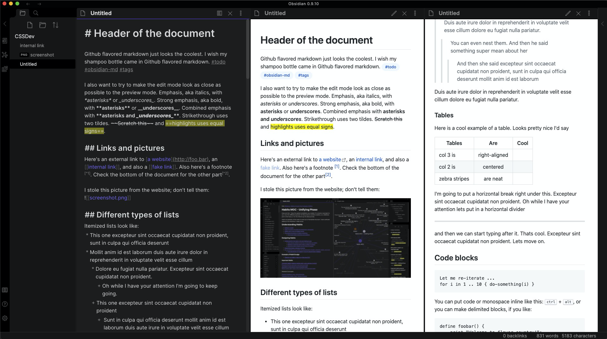

# Gitsidian theme
A basic theme for [Obsidian](https://obsidian.md) that **only changes your preview mode** to look more like GitHub markdown styles--maybe more in the future.

## Fair warning:
- I am not death_au

## Installation
- Download the obsidian.css file and drop it into your vault. Make sure custom themes are turned on.

#### Alternatively:
- If you want to keep your existing theme but use this for preview (and are up for some tinkering) you should be able to copy and paste all of the contents of this obsidian.css into the end of your existing one. It might work straight away, or you might have to resolve a few small conflicts.

## In the future:
- I plan to split this into two different versions:
	1. A version that can be pasted to the end of any theme so that it overrides any theme's preview mode consistently
	2. A full theme that properly responds to dark/light mode and some "github inspired" interface stylings
